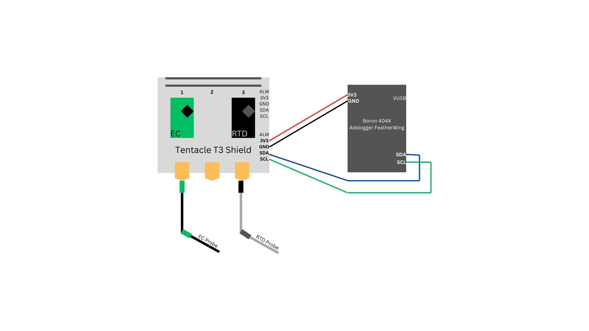

# Initialization of Sensors with Particle Boron 404X
## Change protocol of Atlas Conductivity and RTD Temp Sensors
- Out of the kit, Atlas sensors are in UART mode. We wish to change this mode to I2C mode.
- Manually set the protocol from UART to I2C as described [here,](https://www.whiteboxes.ch/docs/tentacle/t2-mkII/#/protocols) or follow the steps below.
    - Note: Figures use an ArduinoUno, though instructions refer to a Boron.
    - Every connection remains the same except the Arduino powering with the +5V pin: use the VUSB pin on the Boron instead. The VUSB connection uses power directly from the microUSB port.

This procedure is easiest using a breadboard and a set of jumper wires.
1. Place an EZO circuit and a Boron 404X on a breadboard as pictured.
2. Ground the devices (GND, GND)
3. Connect (shortcut)
    - PGND pin to TX pin for EZO: pH, DO, ORP, or EC circuits
    - PRB pin to TX pin for EZO: RTD circuits
4. Power the EZO circuit (GND, +5V)
    - Boron: (GND, VUSB)
5. Wait for LED to change from flashing green to flashing dark blue (UART --> I2C).
    - Note: The Arduino device pictured is only used as a power source. Use an other power source, such as a computer (3.3V-5V).
6. Remove the jumper wire from the PGND (or PRB) pin from the TX pin.
7. Remove power (GND, 5V).
8. Repeat steps 1-7 for additional circuits.

# Wiring Diagram Assembly
1. Stack the EZO circuits on the Atlas Tentace T3 Shield 1 so that the EZO's VCC, PRB, and PGND / PRB pins are nearest to the cable ports.
    - EC on port 1
    - RTDs on port 3
2. Place a lithium cell battery into the Adalogger FeatherWing.
3. Insert a microSD card into the Particle Boron 404x.
4. Stack the Boron onto the Adalogger FeatherWing.
5. Replicate wiring as shown in the following diagram:

    - Ground both devices (GND to GND).
    - Power Boron from USB for now (to transition to solar power, follow the instructions at the end of this page). Power the EZO circuits with the Boron 3V3 input. (Note: Boron can provide stable 3.3V to carrier board long-term.)
    - SCL to SCL
    - SDA to SDA
    - Probes attach to Tentacle T3 Shield.

# Housing assembly
1. Cut the EC probe and RTD probe cables using the guidelines found here: [AtlasScientific - How to properly cut your probe cable](https://files.atlas-scientific.com/how-to-properly-cut-probe-cables.pdf)
2. Lengthen each probe cable with the 2m waterproof 4-wire cables; cover with shrink tubing or electrical tape to ensure water-tightness.
3. CONTINUE ....

## Firmware
1. Firmware can be found in: c3po >> Firmware
2. Copy all code in: Firmware >> AstlasConductivity_20240724 >> src >> AtlasConductivity_20240724.cpp
3. Open a new project in Particle Workbench / VS Code; paste the code you just copied into the generated .cpp file under src (should have the same name as the project you just created).
4. Compile and flash code to the Boron. Once successfully compiled, open the serial monitor to see data.

## Important Links
- [AtlasScientific EZOTM Conductivity Sensor](https://atlas-scientific.com/embedded-solutions/ezo-conductivity-circuit/) - contains documentation, sample Arduino code, and more
- [TheGeographer/water-quality-array](https://github.com/TheGeographer/water-quality-array/tree/master) - a project that used the Atlas probe for water quality measurements

## Transitioning to Solar Power
1. Cut the female 5V 2A connector of of the solar cable and strip the end.
2. Cut the USB A connector of the USB A to Micro-B cable and strip the end.
3. Solder the +5V wires together and the GND wires together. (Can use shrink tubing to keep red and black internal wires separate.)
4. Cover this connection with shrink tubing / electrical tape / your preference.
5. Plug the microB cable into the microB port on the Boron.