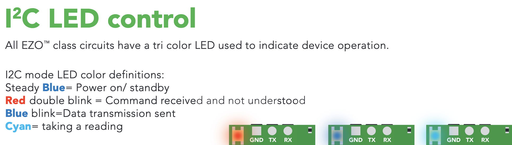

# Changing circuit protocol from UART to I2C

## EZO Circuits: UART to I2C
1. Place an EZO circuit and a Boron 404X on a breadboard.
2. Ground the devices (GND to GND).
3. Shortcut ...
    - EZO EC: RX to PRB on the EC circuit
    - EZO RTD: TX to PRB on the RTD circuit
4. Power the circuit by connecting the circuit's VCC to the Boron's 3V3.
5. Power the Boron with a Micro USB cord to another source, like a laptop.
6. Wait until the LED light on the EC turns dark blue.
7. Unplug the power source. Remove all components from the breadboard.
    - Repeat steps 1-7 for both EZO EC and RTD circuits.

See the picture below for LED statuses for EZO circuits.

# Wiring Diagram Assembly
1. Stack the EZO circuits on the Atlas Tentacle T3 Shield so that the EZO's VCC, PRB, and PGND / PRB pins are nearest to the cable ports.
    - EC on port 1
    - RTDs on port 3
2. Place a lithium cell battery into the Adalogger FeatherWing.
3. Insert a microSD card into the Particle Boron 404x.
4. Stack the Boron onto the Adalogger FeatherWing.
5. Replicate wiring as shown in the following diagram:

- Ground both devices (GND to GND).
- Power Boron from USB for now (to transition to solar power, follow the instructions at the end of this page). Power the EZO circuits with the Boron 3V3 input. (Note: Boron can provide stable 3.3V to carrier board long-term.)
- SCL to SCL
- SDA to SDA
- Probes attach to Tentacle T3 Shield.

# Upper Housing Assembly
1. 

# Lower Housing Assembly
1. 

## Firmware
1. Firmware can be found in: c3po >> Firmware
2. Copy all code in: Firmware >> AstlasConductivity_20240724 >> src >> AtlasConductivity_20240724.cpp
3. Open a new project in Particle Workbench / VS Code; paste the code you just copied into the generated .cpp file under src (should have the same name as the project you just created).
4. Compile and flash code to the Boron. Once successfully compiled, open the serial monitor to see data.

## Important Links
- [AtlasScientific EZOTM Conductivity Sensor](https://atlas-scientific.com/embedded-solutions/ezo-conductivity-circuit/) - contains documentation, sample Arduino code, and more
- [TheGeographer/water-quality-array](https://github.com/TheGeographer/water-quality-array/tree/master) - a project that used the Atlas probe for water quality measurements

## Transitioning to Solar Power
1. Cut the female 5V 2A connector of of the solar cable and strip the end.
2. Cut the USB A connector of the USB A to Micro-B cable and strip the end.
3. Solder the +5V wires together and the GND wires together. (Can use shrink tubing to keep red and black internal wires separate.)
4. Cover this connection with shrink tubing / electrical tape / your preference.
5. Plug the microB cable into the microB port on the Boron.