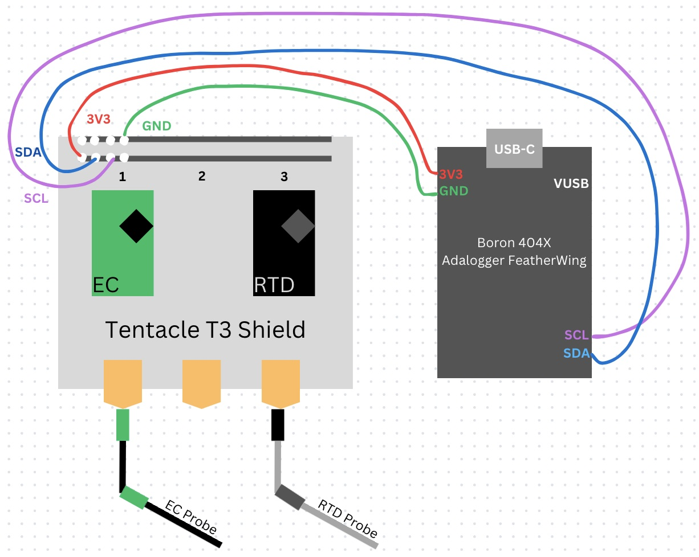

# c3po Setup
## Changing circuit protocol from UART to I2C on EZO Circuits
1. Place an EZO circuit and a Boron 404X on a breadboard.
2. Ground the devices (GND to GND).
3. Short ...
    - EZO EC: RX to PRB on the EC circuit
    - EZO RTD: TX to PRB on the RTD circuit
4. Power the circuit by connecting the circuit's VCC to the Boron's 3V3.
5. Power the Boron with a Micro USB cord to another source, like a laptop.
6. Wait until the LED light on the EC turns dark blue.
7. Unplug the power source. Remove all components from the breadboard.
    - Repeat steps 1-7 for both EZO EC and RTD circuits.

See the picture below for LED statuses for EZO circuits.

## Setting up your Boron
1. Power your Particle Boron 404X from a laptop via the Boron's USB-C port.
2. Navigate to the Particle Device Restore Tool: https://docs.particle.io/tools/device-restore/device-restore-usb/ (note: only works in certain browsers)
3. Click "Select device" – you should see a pop-up window listing your Boron (paired); click it + "Connect"
4. Select "Tinker (Factory Default)" and "6.1.1"
5. Select "Flash Device" (wait until all settings have loaded before moving to the next step)
6. Visit [Blink_LED.cpp](https://github.com/gracelower/c3po/blob/main/Firmware/Blink_LED.cpp) and copy all code; paste it into a new project in VS Code.
    - In your new project, launch Particle CLI. You can put your Boron in DFU mode and use the `particle identify` command in the terminal to ensure your device is being recognized by your computer.
    - Make sure you have selected "Boron" and "6.1.1" in the botton bar of VS Code.
7. Compile the Blink code and flash it to your Boron (make sure the Boron is in DFU mode for this).
    - Boron should flash yellow/green when being put into DFU mode, then should breathe a white/blue light once it’s successfully flashed
    - If you run into issues, try `particle update` and `particle serial identify` commands to update and check Particle's system

## Practice with Boron & Adalogger; initialize microSD card
1. Create a new Particle project (example: RTCtest_"date")
2. Navigate to `src` > `.cpp` file
3. Command/shift/p to open search bar; navigate to "Particle: Install Library"
4. Type `SdFat` and press enter to install the SdFat library
5. A new tab titled `lib` should now be under the `explorer` tab for this project on the left ... open it!
6. Click on 'examples' -> 'ReadWrite' -> 'ReadWrite.ino' – copy all the code on this page.
7. Click the tab that says `src` on the left, then `"project".cpp`
8. Paste the new code you just copied in the `"project".cpp` file AFTER Line 10 (keep `#include "Particle.h"`)
9. Change `#define SD_CS_PIN SS` to `#define SD_CS_PIN D5` (SS -> D5)
10. After `File myFile;` create a new line and paste `SYSTEM_MODE(SEMI_AUTOMATIC); SYSTEM_THREAD(ENABLED);`
11. After `void setup(){` create a new line and paste `Cellular.off();` and in the next line paste `delay(5500);`
12. Where it says `if (!SD.begin(SD_CS_PIN,)) {` paste `if (!SD.begin(SD_CS_PIN,SPI_FULL_SPEED))`
13. Stack your Particle Boron 404x and Adalogger FeatherWing; power via USB-C to a computer.
13. Compile code; flash it to your Boron (again, make sure Boron is in DFU mode)
    - Remember, bottom bar of VS Code should read "Boron" and "6.1.1"
14. Open the serial monitor: Command Palette -> 'Particle: Serial Monitor'
    - Select 'yes' if prompted whether you want to 'automatically reconnect when port is closed'
15. If successful, serial monitor should read:
# INSERT PHOTO

## Wiring Diagram Assembly
1. Stack the EZO circuits on the Atlas Tentacle T3 Shield so that the EZO's VCC, PRB, and PGND / PRB pins are nearest to the cable ports.
    - EC on port 1
    - RTDs on port 3
2. Place a lithium cell battery into the Adalogger FeatherWing.
3. Insert a microSD card into the Particle Boron 404x.
4. Stack the Boron onto the Adalogger FeatherWing.
5. Replicate wiring as shown in the following diagram:

    - Ground both devices (GND to GND)
    - Power Boron from USB for now (to transition to solar power, follow the instructions at the end of this page). Power the EZO circuits with the Boron 3V3 input. (Note: Boron can provide stable 3.3V to carrier board long-term)
    - SCL to SCL
    - SDA to SDA
    - Probes attach to Tentacle T3 Shield

## Firmware
1. Firmware can be found in: c3po >> Firmware
2. Copy all code in: Firmware >> AstlasConductivity_20240724 >> src >> AtlasConductivity_20240724.cpp
3. Open a new project in Particle Workbench / VS Code; paste the code you just copied into the generated .cpp file under src (should have the same name as the project you just created).
4. Open Particle CLI and set the device and OS to "Boron" and "6.1.1" respectively.
5. Place the Boron in DFU mode. (For help, see: https://docs.particle.io/troubleshooting/led/)
6. Compile and flash code to the Boron. Once successfully compiled, open the serial monitor to see data.

# Housings
## Upper Housing Assembly
Note: These assembly instructions are a work-in-progress!
Note: CAD files for internal chassis can be found [here.] (INSERT LINK)
1. Attach cellular antenna to frame on chassis.
2. Using [INSERT SIZE] hex nuts and [INSERT SIZE] screws, fasten stacked Boron/FeatherWing to chassis.
3. Plug solar cable into the Boron USB-C port.
4. Punch out one of the Polycase SK-15 knockouts; place a cable gland in this knockout.
5. Feed the solar cable throught the cable gland.
6. Using [INSERT SIZE] screws, fasten the chassis inside Polycase SK-15.
7. Using [INSERT SIZE] screws, fasten the clear lid to the Polycase.
## Lower Housing Assembly
1. 

## Important Links
- [AtlasScientific EZOTM Conductivity Sensor](https://atlas-scientific.com/embedded-solutions/ezo-conductivity-circuit/) - contains documentation, sample Arduino code, and more
- [TheGeographer/water-quality-array](https://github.com/TheGeographer/water-quality-array/tree/master) - a project that used the Atlas probe for water quality measurements

## Transitioning to Solar Power
1. Cut the female 5V 2A connector of of the solar cable and strip the end.
2. Cut the USB A connector of the USB A to Micro-B cable and strip the end.
3. Solder the +5V wires together and the GND wires together. (Can use shrink tubing to keep red and black internal wires separate.)
4. Cover this connection with shrink tubing / electrical tape / your preference.
5. Plug the microB cable into the microB port on the Boron.